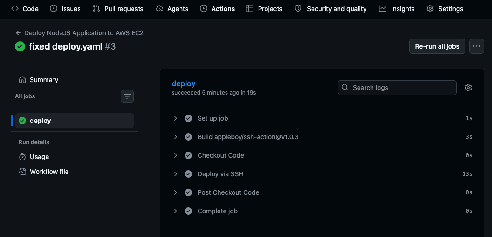

## Things to do beforehand
- create ec2
- create new key-pair (which can be downloaded)
- allow ssh from 0.0.0.0 as github action doesn't provide static ip
- allow tcp to port 8080 from 0.0.0.0

### ssh into ec2 from console
- sudo apt-get update
- sudo apt-get upgrade
- install docker (follow official documentation for installation in ubuntu)
- clone your repo

## initially
``` 
prashidha@Prasiddhas-MacBook-Air Github_Actions % curl http://100.30.227.216:8080
{"message":"Hello from the server"}%    
```

## after performing minor update in index.js and pushing into remote repo

<br>
```
prashidha@Prasiddhas-MacBook-Air Github_Actions % curl http://100.30.227.216:8080
{"message":"Hello from the server, part2"}%     
```